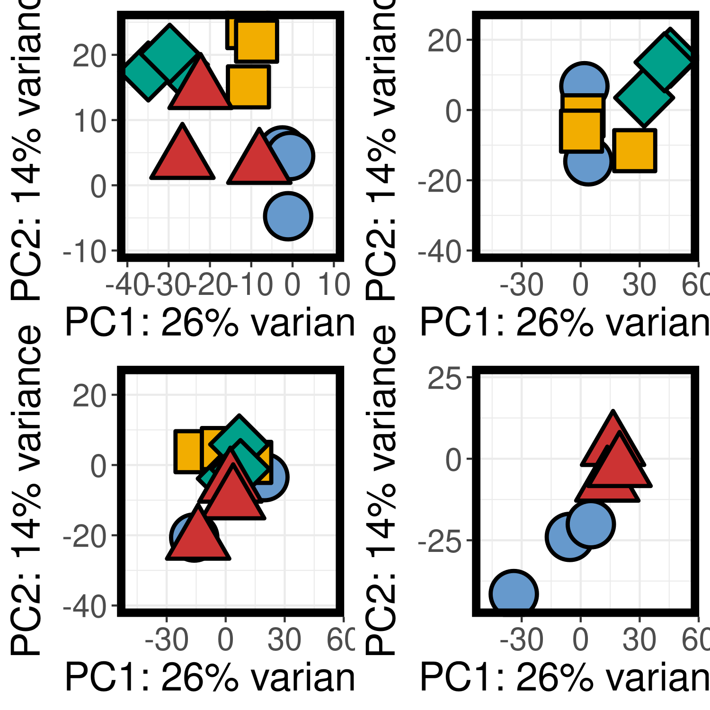
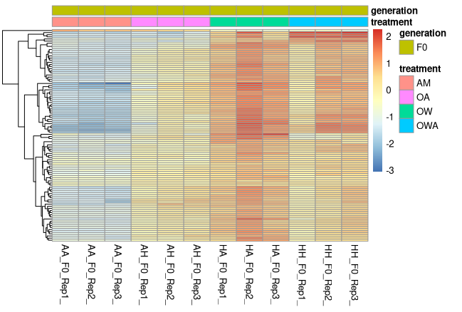
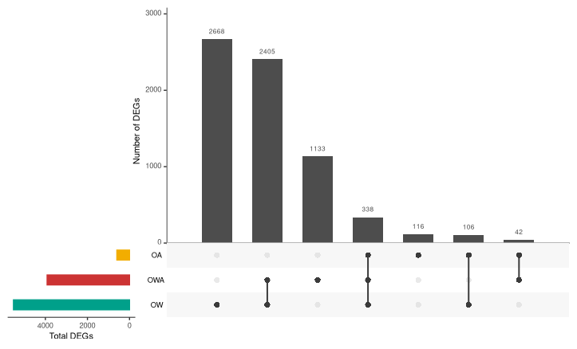

# Transcriptomics Notebook

**Course**: Intro to Ecological Genomics - Fall 2026

**Name**: Syd Houston

------------------------------------------------------------------------

## 9.15.2026 - Setting up Lab Notebook and Learning Markdown

-   Setting up transcriptomics notebook

-   Learn how to take notes in markdown

-   Push notes to github

*Working Directory*

`/gpfs1/home/s/r/srhousto/eco_genomics_2026/transcriptomics`

**Input Files:**

`none`

**Output Files:**

`/gpfs1/home/s/r/srhousto/eco_genomics_2026/transcriptomics/trancriptomics_notebook.md`

**Programs and Dependencies:**

-   `R Version: 4.5.1`

-   `R Studio`

**Scripts:**

`none`

**Code:**

``` r
Library()

print("Hello World")
```

**Table:**

| Col1 | Col2 | Col3 |
|------|------|------|
|      |      |      |
|      |      |      |
|      |      |      |

{width="664"}

**Notes/Observations:**

-   Oh cool graph! It makes sense

**Next Steps**

-   What you want to do next time

------------------------------------------------------------------------

## 9.15.2026 - Diving into Code

-   Setting up transcriptomics notebook

-   Learn how to take notes in markdown

-   Push notes to github

**Working Directory**

`/gpfs1/home/s/r/srhousto/eco_genomics_2026/transcriptomics`

**Input Files:**

`none`

**Output Files:**

`/gpfs1/home/s/r/srhousto/eco_genomics_2026/transcriptomics/trancriptomics_notebook.md`

**Programs and Dependencies:**

-   `R Version: 4.5.1`

-   `R Studio`

**Scripts:**

`none`

**Code:**

``` r
Library()

print("Hello World")
```

------------------------------------------------------------------------

## 9.17.2026 - Experiment Introduction to Copepod Data

AM - Ambient (Control)

OW - Ocean Warming

OA - Ocean Acidification

OWA - Ocean Warming and Acidification

What questions can we ask or hypotheses can we test with this experimental design, with these data?

1.  Change in GE in response to stressor?
2.  Change in GE thru time within a treatment?
    -   which are stable? (\# genes, magnitude of DGE)
3.  Overlap across treatments?
4.  What genes are correlated with the phenotypes from the other paper?

The "Raw Data" is a .fastq or .fq file

Each File has a

1.  Sequence Identifier (Read Name)
2.  Nucelotide Sequence A,T,C,G, sometimes N
3.  Separator Line (usually just a +)
4.  Quality scores for each base.

**Working Directory**

`/gpfs1/home/s/r/srhousto/eco_genomics_2026/transcriptomics`

**Input Files:**

`none`

**Output Files:**

`/gpfs1/home/s/r/srhousto/eco_genomics_2026/transcriptomics/trancriptomics_notebook.md`

**Programs and Dependencies:**

-   `R Version: 4.5.1`

-   `R Studio`

**Code (In Shell):**

``` r
cd /gpfs1/cl/biol3990 #changes the directory

cd C (starting letter of data set) (tab)

cd ll #shows what is inside data set

zcat AA (tab) #helps unzip do not hit enter and print the whole thing!!! - use "head"

zcat AA_F0_Rep3_2_clean.fq.gz | head -n 4 (just shows the first few lines)

zcat AA_F0_Rep3_2_clean.fq.gz | wc -l (says how many times are in a program)
```

------------------------------------------------------------------------

### 9.22.2026 - Getting Github setup more

# New Working Directory:

/gpfs1/home/s/r/srhousto/SydHoustonEcoGenomics/Transcriptomics/mydata

-   added mydata, myresults, and scripts to the transcriptomics folder

-   got the data into 'mydata folder' **Working Directory**

`/gpfs1/home/s/r/srhousto/eco_genomics_2026/transcriptomics`

**Input Files:**

`none`

**Output Files:**

`~/SydHoustonEcoGenomics/transciptomics_labnotebook.md`

`\~/SydHoustonEcoGenomics/Transcriptomics/ahud_DESeq2_inclass.R`

**Programs and Dependencies:**

-   `R Version: tidyverse 4.5.1`

-   `R Studio`

**Scripts**

-   most were copy and pasted from <https://pespenilab.github.io/Ecological-Genomics/Fall2026/tutorials/EcoGen2026_Transcriptomics3_GeneExpressionAnalysis.html>

-   `\~/SydHoustonEcoGenomics/Transcriptomics/ahud_DESeq2_inclass.R`



------------------------------------------------------------------------

### 9.24.2026 - An Overview of everything so far, and some new basic R functions

#1. Where things are:

-   PC

-   VACC (home/class directories)

#2. How to move around:

-   Been using bash commands

#3. How to tell the computer what to do:

-   bash

-   R

#4. How to backup and share work:

-   Github

<!-- -->

-   Our laptop is being connected to the internet through the VACC

#### We are then accessing the VACC through open on demand

-   Using terminal (bash)

-   RStudio (R), you can also access terminal through R studio under the "terminal" tab, "console" is R

#### All of that is being pushed to Github

-   For backup and sharing (the cloud)

Bash - pwd

R - getwd()

#### Bash Uses

-   moving things around

-   managing files/directories

-   running programs (counting lines in a file etc)

-   FastP, Salmon

#### Bash Commands to Know

-   `pwd` : the path to your file
-   `zcat` : print out file
-   `head` : just the top of the data set
-   `cd` : change directory
    -   `..` : moves you back a directory
    -   `.` : from where i am right now
-   `ll` : list long, whats here?
-   `ls` : list
-   `history` : everything youve typed recently in that window
-   ‘arrow up’ gives past commands
-   ‘tab’ to complete
-   `cp` : copy something
-   `rm` : remove something
-   `~` : your personal directory

### R Uses

-   anaylsis/statistics

-   data visualization(plotting)

### VACC file directory

`/gpfs1/cl/biol3990/Transcriptomics/CountsMatrix`

### Notes about my Github/Studio

-   Got "error 5" when trying to open `SydHoustonEcoGenomics` folder - fixed by opening the project in a new window as opposed to the current tab

    ```{r}

    # You can use this to create a data frame, fill with coloumns and values
    data.frame() 

    # combine variables, can use inside data.frame
    c(1, 2, 3)
    c("M", "F")

    # to see the value in a specific part of data frame
    dataframe[coloumn,row]

    # would print all of the values in the height coloumn of the student dataset
    students$height

    # gives the mean of all values in the student height coloumn
    mean(students$height)
    ```

-   its cntrl return to run a command not command return

### 9.29.2026 - Starting with differential gene expression analysis

-   set a new working directory (my data instead of transcriptomics)

-   created a new R script - `9.29.26 AHUD DESEQ pt 2 .R`

-   checked on the results from the DESeq from last class, sorted by most to least significant

### The gene that was chosen to be individually evaluated :

-   `TRINITY_DN30_c0_g2::TRINITY_DN30_c0_g2_i1::g.130::m.130`
-   was upregulated in OW (most) and OWA (second most) but downregulated in OA

### MA plot

-   0 line = ambient line

-   dots show how different each gene is from the grey ambient condition (line)

-   `plotMA(res_OWvsAM, ylim=c(-5,5))`


### Volcano Plot

-   lot more upregulated than downregulated genes


### Heat Map

-   make into a vst



### Euler Plot

-   Scales the sizes of the circles to match the amount of data inside of them

#### Total DEGs

`length(degs_OAvsAM) #602`

`length(degs_OWvsAM) #5517`

`length(degs_OWAvsAM) #3918`

`library(eulerr)`


### Upset plot



## 9.22.2026 - End of DGEA and scatterplots!

-   Only ran the code that was needed for libraries, data, filteingr the data, DESeq, and defining results dataframes

    `case_when() #Basically a if-then statement but for R`

-   `geom_point(alpha = 0.6, size = 1.5)` alpha is opacity, size is point size

### Scatterplot

{width="621"}

-   Values that have a high log fold change may also not be significant because that value may not be consistent across all the replicates

-   Ordering/Layering is important, put 'neither' first so that the other points that are significant layer over the points that are not

-   What is Log2FoldChange? What do higher or lower values indicate?

    -   Positive values (\>0) are upregulation

    -   Negative Values (\<0) are downregulation

    -   0 is no change

-   What if we wanted to change the order of the points? What would you edit?

-   What if we wanted to compare OA vs OWA instead of OW vs OWA? What would you edit?
